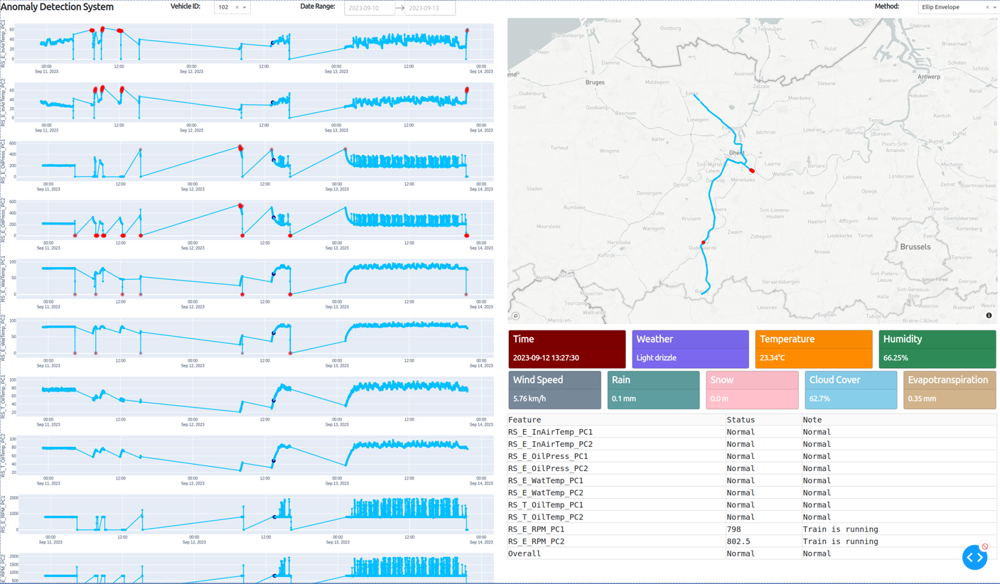

# Data Mining Project - SNCB Cool Train
<div align="center">
<a href="https://www.bruface.eu/">

</a>
</div>

## Overview
This repo is our project "SNCB Cool Train" in the course "Data Mining" at Université Libre de Bruxelles (ULB).

## Built With
<div align="center">
<a href="https://open-meteo.com/">
   
</a>
<a href="https://scikit-learn.org/stable/">
   
</a>
<a href="https://plotly.com/">
   
</a>
</div>

## Setup
1. Here we only use a mini file `ar41_for_ulb_mini.csv`. You can get the full raw data file `ar41_for_ulb.csv` (1.9GB) provided by the lecturer.
2. Go to https://account.mapbox.com/access-tokens/ and create an access token, then put it at `mapbox_access_token=` in the file `app.py`.

## Usage
1. Clone the repo
   ```sh
   git clone https://github.com/hieunm44/dm-sncb-cool-train.git
   cd sdm-sncb-cool-train
   ```
2. Install necessary packages
   ```sh
   pip install -r requirements.txt
   ```
3. Get weather data from https://open-meteo.com/ through API calls then integrate to raw data.
   ```sh
   python3 data_integration.py
   ```
   Then two files `weather_data.csv` and `merged_data` will be created in the folder `data`.
4. Check the file `preprocess_data.ipynb` for data preprocessing and model training. Several data files and model files will be created.
6. Run the visualization app. Here we only use the file `sample_data.csv` (a portion of full data), so that the application can run smoothly.
   ```sh
   python3 app.py
   ```
<div align="center">

</div>
